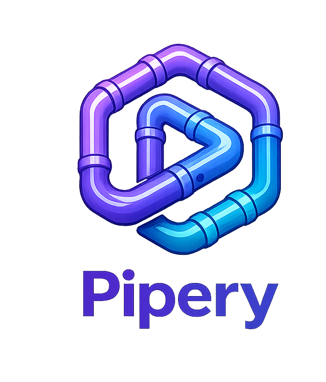

# python-ci



A Python CI automation repository that currently exposes:

- a root composite action at [`action.yml`](/Users/hamed/Project/pipery-dev/python-ci/action.yml)
- a reusable workflow at [`.github/workflows/python-ci.yml`](/Users/hamed/Project/pipery-dev/python-ci/.github/workflows/python-ci.yml)

The action and workflow both support Python package builds with `pip`, `poetry`, or `uv`, optional test and lint stages, artifact upload, and optional publishing.

## What Changed

Release orchestration, fixture-based validation, and repository self-release automation have been decoupled from this repository into [`release-harness`](/Users/hamed/Project/pipery-dev/python-ci/release-harness).

That folder is intended to become a separate release-harness repository that should:

- consume this repo as an action and/or reusable workflow
- contain fixture projects used for validation
- run release qualification checks
- create tags and GitHub Releases for this repo

This keeps the product repository focused on the action/workflow implementation itself while leaving the release tooling ready to be copied into its own repository.

## Action Usage

Use the composite action from a workflow step:

```yaml
name: CI

on:
  push:
  pull_request:

jobs:
  python-ci:
    runs-on: ubuntu-latest
    steps:
      - uses: actions/checkout@v6
      - uses: OWNER/python-ci@v1
        with:
          package_manager: pip
```

## Reusable Workflow Usage

Use the reusable workflow from another repository:

```yaml
name: CI

on:
  push:
  pull_request:

jobs:
  python-ci:
    uses: OWNER/python-ci/.github/workflows/python-ci.yml@main
```

## Inputs

These inputs are available on the reusable workflow and mirrored in the composite action.

| Input | Type | Default | Description |
| --- | --- | --- | --- |
| `python_versions` | string | `""` | JSON array of Python versions. When empty, defaults come from [`workflow-config.json`](/Users/hamed/Project/pipery-dev/python-ci/workflow-config.json). |
| `package_manager` | string | `pip` | Package manager to use: `pip`, `poetry`, or `uv`. |
| `tests_enabled` | boolean | `true` | Enables the test stage. |
| `lint_enabled` | boolean | `true` | Enables the lint stage. |
| `cache_enabled` | boolean | `true` | Enables dependency caching. |
| `project_directory` | string | `.` | Relative path to the Python project inside the repository. |
| `artifact_name` | string | `python-package` | Base name for uploaded artifacts. |
| `version_management` | string | `project` | Version strategy: `project`, `git-tag`, `timestamp`, or `none`. |
| `release_repository` | string | `""` | Optional package repository name or URL used when publishing. |
| `custom_build_command` | string | `""` | Overrides the default build command. |
| `custom_test_command` | string | `""` | Overrides the default test command. |
| `custom_lint_command` | string | `""` | Overrides the default lint command. |

## Secrets

These are only needed if you want to publish packages:

| Secret | Required | Description |
| --- | --- | --- |
| `release_token` | No | Token-based publishing secret. |
| `release_username` | No | Username for repository publishing when token-based auth is not used. |
| `release_password` | No | Password for repository publishing when token-based auth is not used. |

## Default Behavior

If no custom commands are provided, the automation uses these defaults:

| Package manager | Install behavior | Default build command |
| --- | --- | --- |
| `pip` | Installs `build` and `twine`, uses `requirements.txt`, `requirements-dev.txt`, and attempts editable install when appropriate | `python -m build` |
| `poetry` | Installs Poetry and runs `poetry install --with dev` with a fallback to `poetry install` | `poetry build` |
| `uv` | Installs `uv` and runs `uv sync --all-extras --dev` with a fallback to `uv sync` | `uv build` |

Additional defaults:

- tests default to `python -m pytest`
- lint defaults to `ruff check .`, with `flake8 .` used when classic flake8 config files are detected first
- cache is enabled by default
- builds must produce a `dist/` directory so artifacts can be uploaded
- publishing only runs when `release_repository` is set

## Workflow Config

Shared metadata lives in [`workflow-config.json`](/Users/hamed/Project/pipery-dev/python-ci/workflow-config.json).

It currently defines:

- `workflow_version`
- `default_python_versions`

## Files

- [`action.yml`](/Users/hamed/Project/pipery-dev/python-ci/action.yml)
- [`.github/workflows/python-ci.yml`](/Users/hamed/Project/pipery-dev/python-ci/.github/workflows/python-ci.yml)
- [`workflow-config.json`](/Users/hamed/Project/pipery-dev/python-ci/workflow-config.json)
- [`README.md`](/Users/hamed/Project/pipery-dev/python-ci/README.md)

## License

This project is licensed under the MIT License. See [`LICENSE`](/Users/hamed/Project/pipery-dev/python-ci/LICENSE).
